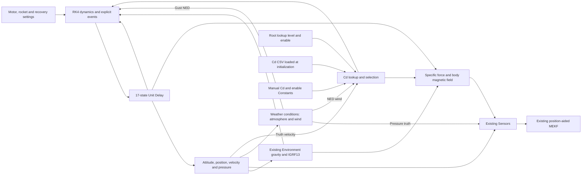

# Physics-driven rocket model

`NavigationRocketPlant.slx` replaces the active trajectory file input with an
original 6DOF dynamics subsystem inside Environment. This model is saved and
open in MATLAB. Its initialization and simulation do not read flight CSVs.
The previous source subsystem is retained, commented out, for reference.
The original project model and the completed recovery model are preserved.

Run `Navigation/runRocketPlant.m` from MATLAB to simulate and export results.
The model has a 350 s stop time, including 50 s of stationary calibration.
Change `Navigation/settings/rocketPlantSettings.m` to configure the rocket.
The older `rocketSettings.m` is an incomplete legacy template and is not used
by this plant. Tests are available as `checkRocketPlant(outputDirectory)`
after adding `Navigation/tests` to the MATLAB path.

The included motor, masses, inertias, nose/fin/tail geometry, drag curves, wind and canopy areas are
**demonstration assumptions**. The existing files contain no complete physical
rocket configuration. The launch site, rail inclination/heading/roll and
400 m main trigger were taken from the prior trajectory metadata; other
values were not identified by fitting that flight. Supply measured inputs
before using this model to predict your rocket's flight.

## Structure

The plant includes a piecewise-linear motor curve, impulse-based propellant
depletion, variable diagonal inertia with approximate angular exhaust flux,
quaternion attitude, separate nose/fin/tail CP moments, aerodynamic damping, altitude-dependent
wind, Mach-dependent drag, and standard-atmosphere density/pressure. Rail
travel is constrained until release. Drogue and main triggers have separate
delays and smooth finite inflation; deployment never resets velocity.
Ground contact stops translation and rotation. Support forces are included
in accelerometer truth.

Environment also contains a stateless `Weather_conditions` subsystem. It
supports station pressure/temperature/humidity, a moist hydrostatic vertical
profile, altitude-dependent NED wind, smooth harmonic gusts and a finite
cosine gust event. Pressure truth feeds the existing sensor interface and
the gust signal drives the rocket loads. The profile is shared by the
weather block and the dynamics so local RK4/CP calculations use the same
conditions. The default preserves the previous dry atmosphere and mean wind.
Configure `Navigation/settings/weatherSettings.m`; see [Weather.md](Weather.md)
for units, temporary scenarios, logging and validation results.

The aerodynamics now follow RocketPy's component Barrowman approach. Body
axial drag acts at the CM; powered/coast drag curves are selected by the motor
burn interval. The conical nose, trapezoidal fin set and narrowing tail have
separate signed normal-force slopes and CPs derived from their geometry.
Each CP sees its own wind height and rotational airflow. Fins include the
Mach compressibility correction with RocketPy's finite transonic plateau,
fin/body interference, fin-count correction, cant-induced roll forcing and
roll damping. Pitch/yaw damping follows from the local CP airflow; optional
residual `AngularDamping` defaults to zero. Geometry uses meters and fin cant
uses radians. `NoseCPFraction` can represent another nose shape's CP fraction.

The root model exposes `Cd_control_level` (port 1) and `Cd_lookup_enabled`
(port 2) for the CSV-backed lookup. The retained manual Constants provide
`Cd_command` (SID `1604`, saved value 1) and `Cd_override_enabled` (SID
`1600`, saved value 0) to Environment ports 1 and 2. A manual enable of 1
selects the **absolute** dimensionless command with priority over lookup.
The command must be a finite, real, nonnegative numeric scalar; enables must
be 0 or 1. With both enables zero, the configured powered/coast curves remain
active. Selection is sampled at `Rocket.Ts` (20 ms by default) and the chosen
coefficient is held throughout every internal RK4 stage. This input changes
axial body drag at the CM. The existing canopy inflation fade still applies;
fully inflated recovery removes the body drag contribution. Component normal
forces, CPs, fin roll coefficients and parachute CdS retain their own models.
The input applies directly; actuator rate/position dynamics are not included.

Run `Navigation/runRocketCdExample.m` for a manual-Cd example using temporary
`SimulationInput.setBlockParameter` overrides of the retained Constants.
Resolve their SIDs to block paths before applying parameters; see
[CdControl.md](CdControl.md). The earlier 0.9-Cd scenario from 53 to 65 s and
its archived results used the model's former direct command/enable root
inputs. The current root interface accepts the two lookup signals.
`out.RocketCdControl` logs the following five columns at `Rocket.Ts`:
`[Cd_nominal, Cd_command, enable, Cd_effective, body_scale]`. The nominal
curve is evaluated even while overridden. Body scale includes `AeroEnabled`
and the recovery fade. The original 18-column flight diagnostics stay intact.
See [CdControl.md](CdControl.md) for the MATLAB API and validation results.

The root inputs `Cd_control_level` and `Cd_lookup_enabled` feed Environment
ports 3 and 4 and select a velocity/control lookup sourced from CSV columns
`Cd,velocity,level`.
Configure its file path in `settings/rocketCdLookupSettings.m` and edit
`settings/cd_lookup_example.csv` or supply measured data. Control nodes are
0:0.1:1. The table uses CM air-relative speed, bilinear interpolation and
edge clipping, and is read once at initialization. Direct Cd override has
priority; the saved manual enable and default lookup enable are zero. The
unused `Control` placeholder remains separate. See [CdLookup.md](CdLookup.md) and
`Navigation/runRocketCdLookupExample.m`.

For the demonstration geometry, nose/fin/tail CP body Z positions are
0.9167, -0.7788 and -1.1722 m relative to the fixed CM. A positive Z points
toward the nose. Use measured geometry and CG positions for your rocket.
`rocketPlantBuildAero` derives the component arrays during initialization;
`rocketPlantAerodynamics` evaluates their forces, moments and diagnostics.
At Mach 0.3 the nose/fin/tail slopes are 2.000, 9.951 and -0.720 rad^-1;
the total is 11.231 rad^-1 and the weighted CP is 0.452 m aft of the CM,
giving 3.011 body diameters of static margin. At Mach 1 that margin is 3.088
diameters. The minimum during this flight is 2.999 diameters.

RocketPy switches to parachute descent dynamics. This plant retains 6DOF
attitude and canopy attachment moments, so its body aerodynamic contribution
smoothly fades to zero as the first canopy inflates. This avoids continuing
the small-angle rocket law throughout canopy descent and introduces no
deployment velocity reset.

Body +Z is longitudinal. Quaternion output is Hamilton scalar-last, body to
NED. Internal positions are local NED; the existing output remains
`[North;East;absolute MSL altitude]`. GNSS retains its ellipsoid-height output,
independent sampling and position-only aiding. No persistent variables are
used. Every dynamic/event state belongs to the Unit Delay. The adapter is a
stateless Level-2 MATLAB S-function for host simulation, without an embedded
code-generation interface.

The model approximates fixed, coincident dry/propellant centers of mass and
diagonal inertia. It omits moving-CM coupling, detailed motor/grain geometry,
flexible bodies, canopy/line dynamics, Earth rotation and measured stochastic
turbulence. The weather system provides reproducible synthetic gusts.
The normal-force law is linear in angle of attack and extrapolates outside
its small-angle domain near apogee. Axial drag follows RocketPy's forward
flight convention and is not a general reverse-flow or stalled-body model.
Its atmosphere is intended for the standard-atmosphere altitude range. It is
an original reduced model, not a numerical replica of RocketPy. The existing
barometric inverse uses a simpler atmosphere, so it can differ slightly from
the new truth pressure model at altitude.

## Validation results

All eight core numeric suites and nine aerodynamic suites passed. The core
checks cover ballistic motion, constant thrust, propellant
conservation, analytic quaternion rotation, IMU/magnetic frames, rail direction,
continuous canopy deployment, and complete flight with step refinement.
Aerodynamic checks cover primary-source geometry coefficients, signed tail
loads, force/moment sums, restoring moments, local pitch and roll damping,
fin cant, transonic behavior, CP wind height under rotated attitudes, static
margin and zero-air/disabled behavior. A separate load check confirmed the
continuous recovery fade and zero body-aero contribution at full inflation.
Refining the internal step from 4 ms to 2 ms changed apogee by 0.00448 m and
peak speed by 0.00101 m/s in the constant-gravity standalone check. Quaternion
norm error stayed below 2.23e-16. These checks validate implementation behavior;
they do not validate the demonstration parameters against hardware.

All eleven additional weather checks passed, including neutral/default
equivalence, station anchoring, dry analytic hydrostatics, moist hydrostatic
gradients, density/sound-speed consistency, wind coordinates, smooth gust
boundaries, load coupling, major-step sampling and invalid-input rejection.

The integrated 350 s run, using the existing Environment gravity model,
completed with finite states and navigation outputs. It also completed from
a different working directory using the runner. CSV workspace variables were
cleared before the first full run, and the active model has zero From Workspace
blocks. The new subsystem has no structural errors or warnings; the whole
model retains four pre-existing warnings in the magnetic model/root wiring.

| Result | Integrated demonstration |
| --- | ---: |
| Ignition | 50 s |
| Apogee | 3156.264 m AGL at 73.883 s |
| Peak speed | 329.861 m/s |
| Drogue deployment | 74.883 s |
| Main deployment | 176.772 s, 392.322 m AGL after its 0.3 s delay |
| Landing | 227.960 s |
| Peak body rate | 3.054 rad/s |
| In-flight position RMS error | 50.177 m |
| Launch peak position error | 586.297 m |

Compared with the previous combined-CP model, apogee changes by +0.760 m and
landing occurs 1.160 s earlier. The angular response changes more than peak
speed: maximum body rate rises from 2.064 to 3.054 rad/s. These are effects
of the new assumed component geometry and force law, not measured fidelity
improvements. The old source/configuration and run are archived under
`validation/aerodynamics-v1-baseline/`; the component results and plots are
under `validation/aerodynamics-v2/`.

The large launch error is in the existing estimator output, predominantly
horizontal. It recovers later. The MEKF settings were
tuned against the earlier recorded trajectory and need a separate diagnosis
under physical truth. This task does not attribute that error to a specific
update without an ablation study, and it does not change sensor calibration
or estimator tuning to conceal it.

Sensors and Navigation estimator system XML were compared with the completed
recovery model. Behavioral contents match, and all 19 original Stateflow chart
contents match after excluding editor display state and derived signal-label
metadata. See `validation/component-preservation.json`.

Outputs in `validation/` include the generated trajectory CSV (an output,
not an input), full SimulationOutput MAT file, test and flight-summary JSON,
and `rocket-flight-checkup.png`.

`summarizeRocketAerodynamics(out,Rocket,baseline,outputDirectory)` produces
the component coefficient/static-margin sweep and the old/new trajectory
comparison. It also separates powered-flight angles from large angles near
apogee, with their Mach and dynamic pressure. See the JSON and vector PDF
in `validation/aerodynamics-v2/`.
Powered free-flight component angle of attack peaks at 4.623 degrees. Before
drogue inflation it reaches 85.991 degrees near apogee, at CM Mach 0.033 and
dynamic pressure 46.645 Pa. The latter is outside the linear law's reliable
angle domain. Final navigation position error is 1.479 m; the launch peak
error still requires a separate estimator diagnosis.

Architecture references: [RocketPy generalized equations](https://docs.rocketpy.org/en/latest/technical/equations_of_motion_v1.html),
[rocket configuration](https://docs.rocketpy.org/en/latest/user/rocket/rocket_usage.html),
[parachute triggers and delays](https://docs.rocketpy.org/en/latest/reference/classes/Parachute.html),
and [NASA standard atmosphere](https://ntrs.nasa.gov/citations/19770009539).

Aerodynamic references: [component forces and moments](https://docs.rocketpy.org/en/latest/_modules/rocketpy/rocket/aero_surface/aero_surface.html),
[fin normal force and roll](https://docs.rocketpy.org/en/latest/_modules/rocketpy/rocket/aero_surface/fins/fins.html),
and [fin roll equations](https://docs.rocketpy.org/en/latest/technical/aerodynamics/roll_equations.html).
