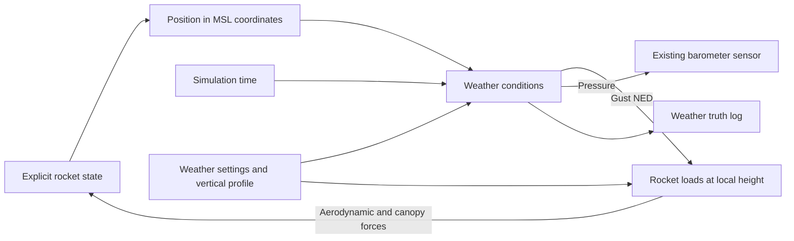

# Environment weather conditions

`Weather_conditions` lives inside Environment in `NavigationRocketPlant.slx`.
Configure it in `Navigation/settings/weatherSettings.m`. The default uses
the existing dry standard atmosphere and mean wind profile, with zero gusts.
It therefore preserves the previous component-aerodynamics flight.

The subsystem reads absolute MSL position and simulation time. It produces
wind toward North/East/Down in m/s, atmosphere truth
`[density;pressure;soundSpeed;temperature;relativeHumidity]`, and gust velocity
in NED. Density is kg/m^3, pressure Pa, sound speed m/s, temperature K and
relative humidity a fraction. Its gust signal drives the rocket step and
force computation; its pressure drives Environment's existing pressure
output. Both use the same weather configuration. There are no persistent
variables or random streams. Gravity and IGRF retain their existing models.



Set `Weather.UseProfile = 1` to enable the configured station temperature,
pressure and humidity. `rocketWeatherBuildProfile` builds the vertical
hydrostatic profile during initialization, integrating from the station
upward and downward. It uses geopotential height, the configured temperature
offset/lapse correction and a decaying relative-humidity profile. Moisture
affects hydrostatic pressure, density and the ideal-mixture sound speed.
Runtime lookup uses the resulting tables; it does not integrate a second
atmosphere state. `UseProfile = 0` calls the original atmosphere directly.

`Weather.WindAltitudeAGL` and `Weather.WindNED` define the mean wind versus
height above the launch site. The profile is linearly interpolated and held
at its endpoints. A meteorological wind direction is the direction **from**
which it blows: speed V from direction theta degrees clockwise from North
corresponds to `[-V*cosd(theta);-V*sind(theta);0]` in NED. Positive Down is a
downward air velocity.

Gusts combine a finite sum of harmonics with a smooth startup and a separate
finite-duration cosine pulse. `GustRmsNED` specifies each axis's nominal
long-duration RMS; `GustFrequenciesHz`, `GustWeights` and `GustPhases` define
the reproducible excitation. `DiscreteGustPeakNED` sets the pulse's peak
vector. This is synthetic gust excitation, not a validated stochastic
Dryden/von Karman turbulence model or a live weather forecast. The driver is
sampled at `Rocket.Ts` and held during the RK4 substeps; local altitude/wind
shear is still evaluated at each aerodynamic CP and intermediate state.

For a permanent scenario, edit `weatherSettings.m`; the model initialization
validates and rebuilds the profile. For a temporary scenario after running
`rocketPlantMain.m`, configure and validate a separate Weather structure and
pass it using `Simulink.SimulationInput`. Override `InitFcn` to the empty
string on that input so the model's default initialization does not replace
the temporary configuration. This simulation override does not alter the
saved model.

```matlab
Weather.UseProfile = 1;
Weather.StationTemperatureK = Weather.StationTemperatureK + 8;
Weather.StationPressurePa = Weather.StationPressurePa - 1200;
Weather.StationRelativeHumidity = 0.45;
Weather.GustEnabled = 1;
Weather.GustRmsNED = [1; 0.5; 0.15];
Weather.DiscreteGustStartTime = 80;
Weather.DiscreteGustDuration = 20;
Weather.DiscreteGustPeakNED = [4; -2; 0.5];
Weather = rocketWeatherBuildProfile(Weather);
rocketWeatherValidateConfig(Weather);
in = Simulink.SimulationInput('NavigationRocketPlant');
in = in.setModelParameter('InitFcn','');
in = in.setVariable('Weather',Weather);
out = sim(in);
```

These are demonstration weather inputs. Replace station measurements and
wind profiles with data for the launch site and date before predicting a
real flight. No automatic weather-data download is performed.

`out.WeatherTruth` is a timeseries with eleven columns:

| Columns | Meaning |
| --- | --- |
| 1:3 | Total wind North, East, Down (m/s) |
| 4 | Air density (kg/m^3) |
| 5 | Pressure (Pa) |
| 6 | Sound speed (m/s) |
| 7 | Temperature (K) |
| 8 | Relative humidity (fraction) |
| 9:11 | Gust North, East, Down (m/s) |

`checkRocketWeather(outputDirectory)` checks weather physics, the neutral
baseline, gust boundaries, frame conventions and coupling to the plant.
`summarizeRocketWeather(out,Rocket,Weather,baseline,outputDirectory)` exports
the weather trace, flight comparison, JSON diagnostics and PNG/vector PDF.

All 28 numerical suites passed (8 core, 9 aerodynamics and 11 weather).
Both integrated simulations completed for 350 s with finite states and
navigation outputs. The neutral run's largest absolute state difference
from the earlier component model was 7.50e-10. Weather pressure and the
force-truth debug pressure agreed exactly. The weather and rocket subsystems
have no structural issues; the four pre-existing whole-model wiring warnings
remain. The saved Sensors/Navigation subsystem XML and all original chart
files match the pre-weather model byte for byte.

The synthetic scenario used station temperature +8 K, pressure -1200 Pa,
RH 45%, lapse-rate offset +0.0005 K/m, mean wind increment
`[2;-1;0]` m/s, harmonic RMS `[1.2;0.8;0.15]` m/s and a 20 s gust pulse with
peak `[4;-2;0.5]` m/s starting at simulation time 80 s. The example above
uses slightly smaller harmonic RMS and no mean/lapse change; use the saved
scenario MAT file's `Weather` structure to reproduce this exact check.

| Result | Neutral default | Synthetic weather |
| --- | ---: | ---: |
| Apogee AGL | 3156.264 m | 3231.378 m |
| Peak speed | 329.861 m/s | 331.523 m/s |
| Landing time, including 50 s prelaunch | 227.960 s | 227.700 s |
| Peak body rate | 3.054 rad/s | 3.136 rad/s |
| In-flight navigation RMS position error | 50.177 m | 96.686 m |
| Launch peak navigation position error | 586.297 m | 672.379 m |

Peak wind magnitude was 11.552 m/s and peak gust magnitude was 5.236 m/s.
The current estimator's increased error demonstrates sensitivity to this
combined weather scenario; no ablation assigns the increase to an individual
wind, temperature or pressure effect. Sensors and MEKF settings were not
modified. Weather temperature/humidity affect atmospheric truth; additional
temperature-dependent electronics errors would require separate sensor work.

Results are under `validation/weather-v1/neutral/` and
`validation/weather-v1/warm-humid-gusty/`. Each MAT file contains `out`,
`Rocket`, `Weather`, `rocketSummary` and `weatherSummary`. The saved model
and `weatherSettings.m` retain the neutral default; the synthetic scenario
was applied only using SimulationInput overrides.

[Weather comparison plot](validation/weather-v1/warm-humid-gusty/rocket-weather-comparison.png)

References: [NASA sound speed](https://www.grc.nasa.gov/www/k-12/BGP/snddrv.html),
[UCAR hydrostatic equation](https://www.ncl.ucar.edu/Document/Functions/Built-in/hydro.shtml),
[NOAA saturation vapor pressure](https://www.weather.gov/media/epz/wxcalc/vaporPressure.pdf),
and [MathWorks wind direction convention](https://www.mathworks.com/help/aeroblks/horizontalwindmodel.html).
